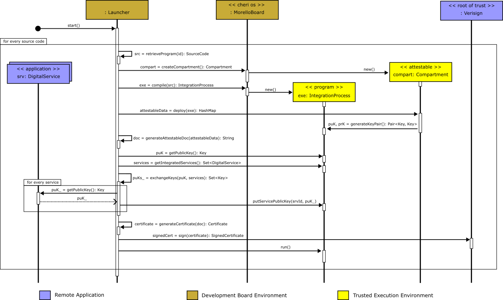
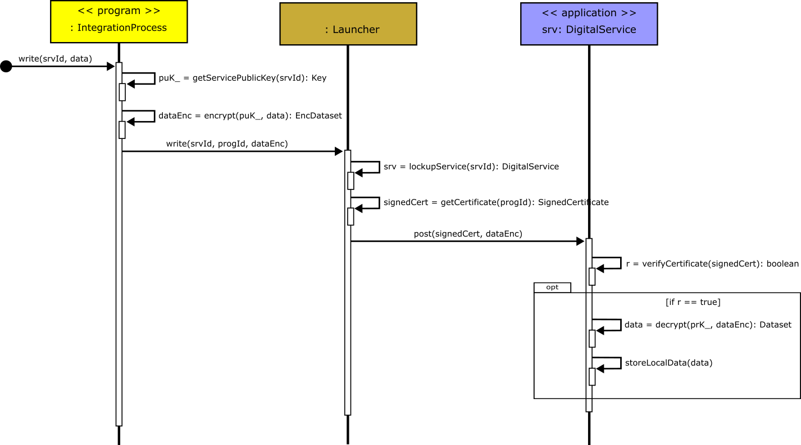

<h1 style="font-size: 2em;">A use-case for attestable evaluation</h1>

This repository focuses on evaluating two key attestable properties:

- The operation of the cloud-based attestation procedure discussed in the [attestablelauncher repository](https://github.com/CAMB-DSbD/attestablelauncher).
- Some performance properties of compartments created on a Morello Board, using a library compartmentalisation tool.

To explore these properties, we have implemented an **Enterprise Application Integration (EAI)** solution, also referred to as an **Integration Solution**, which operates within a trusted execution environment (TEE) on experimental Morello Board hardware.

In the implemented case study, a store offers a promotion to its customers: if a customer spends more than $150.00, they receive a ride home in an app-based car service, paid for by the store. This business strategy integrates the store’s operations with the transportation service, promoting sales and enhancing customer convenience through seamless digital service integration. The integration process is executed inside a TEE, demonstrating how secure communication and interaction between different digital services, running on distinct remote servers, can be achieved in a trusted environment.

We demonstrate how to execute an integration process within a TEE using Morello Board hardware located in Canada. The case study implements three mock digital services (apps) running on distinct remote servers in Brazil, along with an integration process (program) written and compiled for **CHERI capabilities (cheri-caps)**. The integration process runs inside a secure compartment.

## Conceptual View of the EAI

A conceptual view of the application involved in the EAI is illustrated in Figure 1.

*Figure 1: Conceptual View of the EAI. (Author: Carlos Molina-Jimenez, Computer Lab, University of Cambridge. CAMB project).*

The EAI integrates three main components: the store, taxi, and messaging services. These components act as servers, and the EAI operates as a client that sends requests to these services. The interaction between the EAI and the component applications follows a message-driven process:

1. The EAI requests a copy of the bill for a store's client, for example, Alice.
2. The store responds with the bill amount. Let's assume the bill is above $150.00, which entitles Alice to a courtesy taxi ride.
3. The EAI sends a request to the taxi service to arrange a ride for Alice.
4. The taxi service responds with the taxi's number and the driver’s name, confirming that a taxi is ready for boarding.
5. The EAI then sends a message to Alice, offering her the taxi service.
6. Alice responds with an acceptance of the offer.

## Implementation architecture of the EAI

In the Figure 2, we assume that the implementation of the EAI is delegated to a third-party company (say, Bob's), and that the four involved parties do not necessarily trust each other. For example, the store, taxi, and messaging services are hesitant to provide their data to the EAI unless Bob implements mechanisms that ensure data protection during execution. This is a critical requirement that our implementation addresses. As shown in the following figure, we use an attestable to meet this requirement.

*Figure 2: Enterprise Application Integration with Data Protection (Author: Carlos Molina-Jimenez, Computer Lab, University of Cambridge. CAMB project).*

In the Figure 2, we use the following notation: the applications (store, taxi, and messaging services) execute on conventional platforms, represented by the "env" boxes with single lines. The attestable (att) is depicted by a double-lined box to indicate that it provides an execution environment that guarantees data protection. The EAI is deployed and executed inside the attestable to protect the data provided by the applications. It's important to note that the EAI acts as a client of the three servers (store, taxi, and messaging) and is programmed to periodically make requests.

To illustrate the practicality of our current implementation, we highlight that the attestable is created on a Morello Board physically located in Toronto, while the applications run on conventional computers located at the Applied Computing Research Group of the University of Ijuí, Brazil.

# Functionality of the Components

### 1) App-Store, App-Transport, and App-Whatsapp

Each of these directories contains the following components:

- **API**: Each directory includes an API file (`API1.py`, `API2.py`, `API3.py`) responsible for providing specific endpoints:
  - **API1.py (App-Store)**: Provides the `/api/sales` endpoint to check the last sale.
  - **API2.py (App-Transport)**: Provides the `/api/trips` endpoint to book a trip.
  - **API3.py (App-Whatsapp)**: Provides the `/send-message` endpoint to send a confirmation message via WhatsApp.
- **Database**: The databases (`compras.db`, `transport_app.db`) are used to store relevant data for sales and transport bookings.
- **Key Pair**: Each application has its own key pair (`cert.pem`, `priv.pem`), used for secure communication.

### 2) Launcher

- **launcher.py**: A server that manages the upload, compilation, and execution of programs inside a TEE within secure compartments. It runs on the operating system outside the TEE and handles the following tasks:
  - Manages upload requests.
  - Compiles C code (`integration_process.c`) written with CHERI capabilities (cheri-caps).
  - Executes the compiled binary code inside a single compartment.
  - Creates and stores the required certificates locally, outside the TEE.
  
- **command-line-interface.py**: A command-line interface (CLI) client for interacting with the `launcher.py` server. It allows the user to:

  1. List files  
  2. Upload a file  
  3. Delete a program  
  4. Compile a program  
  5. Execute a program  
  6. Exit

- **generate_certificate.py**: This script generates certificates and keys for the `integration_process` executable binary code. The certificates include:
  - CPU model.
  - Number of CPUs.
  - Memory addresses.
  - Hash of the executable binary code.
  - Signature added to the certificate for attestation.

### Programs and Data Structure

- **programs-data-base/sources**: Contains the source code of programs written in C (e.g. `integration_process.c`).
- **programs-data-base/cheri-caps-executables**: Stores the executable binary codes generated for CHERI capabilities (cheri-caps).
- **programs-data-base/certificates**: Contains the attestables and the keys generated for the secure execution environment of each executable binary code.
- **attestable-data/signatures**: Stores the signatures of the executable binary codes for attestation purposes.

   
### Execution Sequence

1. **Launcher Initialisation**
   - The launcher is started by running `launcher.py`.
   - Once started, the launcher is ready to receive requests to upload, compile, and run programs.

2. **Code Upload**
   - The CLI (`command-line-interface.py`) is used to upload a C program (e.g. `integration_process.c`) to the Morello Board environment.
   - The launcher saves the uploaded file in the `programs-data-base/sources` folder and updates the `file_database.json`.

3. **Code Compilation**
   - A request to compile the source code is made via the CLI.
   - The launcher compiles the source code for CHERI capabilities and saves the executable binary code in the folder `programs-data-base/cheri-caps-executables`.
   - A corresponding certificate directory is created inside the folder `programs-data-base/certificates`.

4. **Code Execution**
   - The compiled binary code is executed via the CLI.
   - The launcher runs the binary and returns the output.

5. **Certificate Generation**
   - During execution, the `integration_process.c` calls the `generate_certificate.py` script located inside the folder `attestable-data`.
   - The `generate_certificate.py` script generates the corresponding keys and certificates for the running executable binary code, including information such as CPU model, number of CPUs, and memory addresses.

6. **Interaction with External APIs**
   - The `integration_process.c` makes HTTPS calls to the defined APIs (`API1_URL`, `API2_URL`, `API3_URL`), using OpenSSL to check sales, book trips, and send confirmation messages via WhatsApp.

# Attestation and Set-Up of the Attestable

The integration process compilation and execution is managed by a launcher program that operates outside the TEE but remains within the Morello Board operating system. In this case study, the integration process functions as a client, invoking remote servers represented by digital service applications (apps).

The flow of interactions between the launcher, integration process, and the remote servers is depicted in the sequence diagram shown in Figure 3.

*Figure 3: Sequence diagram of the attestation and interaction process in the Integration Solution (Author: Rafael Zancan-Frantz, Applied Computing Research Group, Unijui University, Brazil).*

The sequence diagram in Figure 3 provided a detailed view of the attestation process and the interaction between the launcher, integration process, and external services within the Integration Solution. Below is a structured explanation of the steps involved, from compartment creation to interaction with external services:

1. **Launcher Initialization**: The launcher is initialized by invoking the `start()` operation, which runs outside the secure zone of the Morello Board operating system. This prepares the system to handle various operations such as uploading, compiling, and executing programs.

2. **Retrieving Source Code**: The launcher retrieves the required source code from its local database using the `retrieveProgram(id)` operation. This is the integration process's source code, which is fetched for further stages.

3. **Compartment Creation**: The launcher calls the `createCompartment()` operation to create a secure execution environment (compartment) on the Morello Board. This compartment ensures that the integration process runs within a protected environment.

4. **Compilation for TEE**: After retrieving the source code, the launcher compiles it for CHERI capabilities using the `compile(src)` operation. The result is an executable binary (`execPrc`) that is compatible with the trusted execution environment, ensuring secure execution.

5. **Deploying the Integration Process**: The compiled executable binary is deployed into the secure compartment through the `deploy(execPrc)` operation. This step generates attestable data, represented as a `HashMap`, which is critical for ensuring that the process runs securely within the compartment.

6. **Key Pair Generation**: During execution, the integration process generates a key pair using the `generateKeyPair()` function, producing a public key (`puK`) and a private key (`prK`). These keys facilitate secure communication with external services.

7. **Certificate Generation**: The launcher collects necessary data, including attestable information, and generates a certificate using the `generateAttestableDoc()` and `generateCertificate()` operations. This certificate is signed by a trusted authority, such as Verisign, using the `sign()` operation to verify the integrity and security of the process.

8. **Public Key Exchange**: The launcher performs a key exchange between the integration process and external services. The public keys of the services are retrieved using the `getPublicKey()` operation and exchanged with the integration process for secure communication.

9. **Execution of the Integration Process**: Finally, the launcher invokes the `run()` operation, executing the compiled integration process within the secure compartment. This ensures that all communication and interactions with external services (e.g., store, transport, and messaging services) are securely conducted within the TEE.

# Execution of a Read Operation

The following diagram illustrates the sequence of events in the execution of a read operation that the EAI performs against one of the applications, such as the storage service, to request data.

*Figure 4: Sequence diagram of the read operation executed by the EAI (Author: Rafael Zancan-Frantz, Applied Computing Research Group, Unijui University, Brazil).*

# Execution of a Write Operation

The following diagram illustrates the sequence of events in the execution of a write operation that the EAI performs to send data to one of the applications. For instance, the EAI executes a write operation against the **msg** application to notify it that a client is ready for a taxi ride home.

*Figure 5: Sequence diagram of the write operation executed by the EAI (Author: Rafael Zancan-Frantz, Applied Computing Research Group, Unijui University, Brazil).*

## Corresponding Author

**Regis Rodolfo Schuch**  
*Applied Computing Research (GCA) Group, Unijui University, Brazil*  
[regis.schuch@unijui.edu.br](mailto:regis.schuch@unijui.edu.br)

